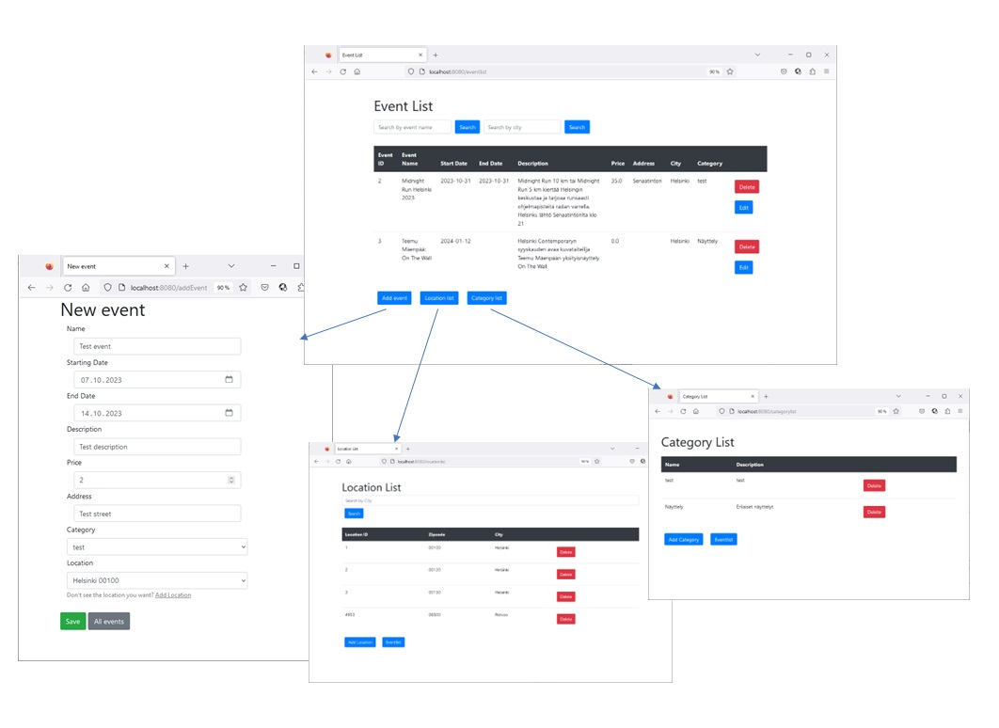
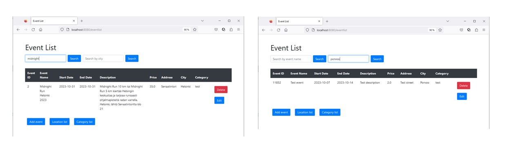
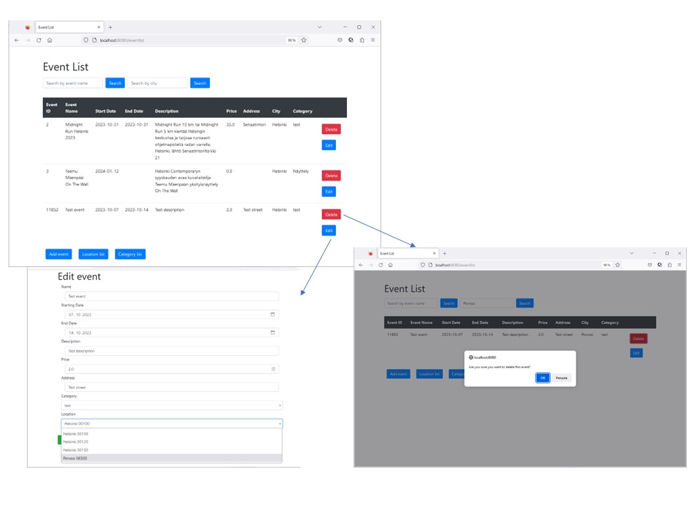
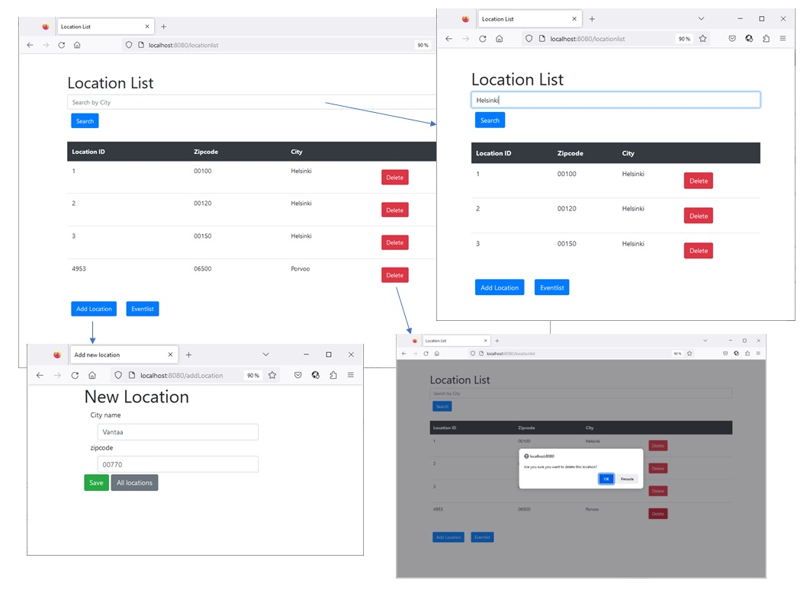
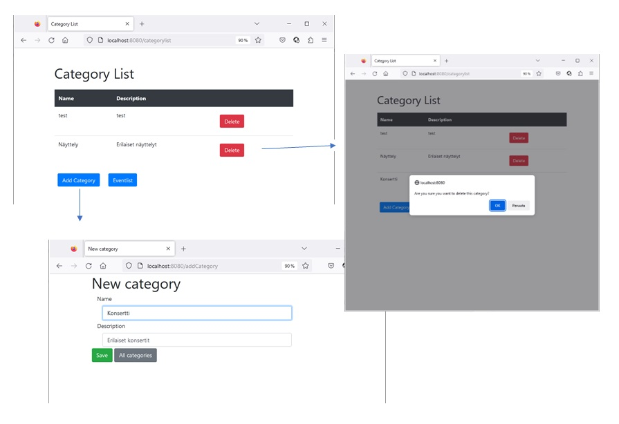
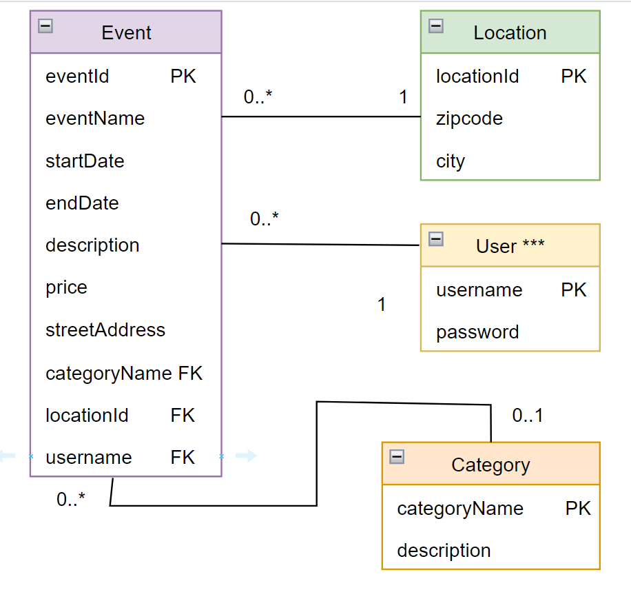
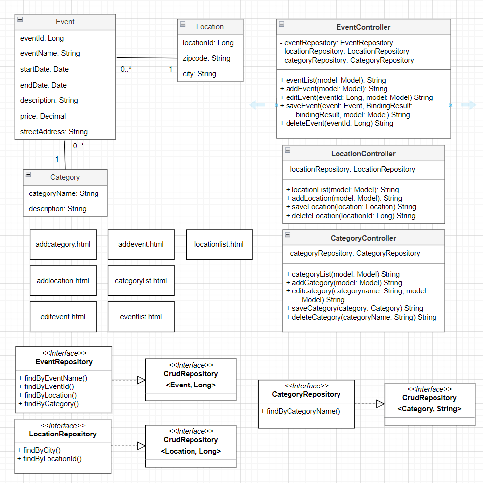

# "Mitä tänään tehtäisiin?"

Tiimi: Lairi Piia, Martinonyte Dovile, Muittari Samuel, Myllymäki Aliisa, Rautiainen Aleksis, Rusi Romeo

## Johdanto

<!-- Johdantoon kirjoitetaan lyhyt, ytimekäs kuvaus siitä, mikä on projektin aihe,
kuka on asiakas (käyttäjä), mitä hän haluaa ja saa järjestelmältä, mitä
tekniikoita käytetään ja mitä konkreettisesti on valmiina, kun projekti päättyy.

-   Järjestelmän tarkoitus ja tiivis kuvaus siitä, mistä on kyse ja kenelle järjestelmä on tarkoitettu.
-   Toteutus- ja toimintaympäristö lyhyesti:  
    -   Palvelinpuolen ratkaisut ja teknologiat (esim. palvelinteknologia, mikä tietokantajärjestelmä on käytössä)
    -   Käyttöliittymäratkaisut ja teknologiat (esim. päätelaitteet: puhelin,
    täppäri, desktop)
    -->

Projektin tarkoitus on luoda houkuttelevaa tekemistä ja ajanvietettä tarjoava sovellus. Sen avulla käyttäjä voisi löytää monenlaista sääolosuhteisiin sopivaa tekemistä haluamalleen ajankohdalle.
Sovelluksen nimi on "Mitä tänään tehtäisiin?".

Sovellusta voivat hyödyntää sekä yksityishenkilöt, että tapahtuma- ja vapaa-ajantoiminnan järjestäjät.
Tapahtumien luonti on helppoa ja palvelun avulla toimijat voivat mahdollisesti tavoittaa tavallista suuremman kävijämäärän.

Sovelluksen avulla käyttäjä voi selata tapahtumia sään, paikan ja ajankohdan perusteella. Hyödyntäen omaa sijaintia käyttäjä voi hakea lähellä olevia tapahtumia. Rekisteröity käyttäjä voi luoda, muokata ja poistaa luomiaan tapahtumia. Järjestelmävalvojalla on oikeus hallinnoida kaikki tapahtumailmoitukset.

Käyttäjien lisäämien tapahtumien lisäksi sovellukseen haetaan tapahtumia myös avointa dataa käyttäen. Helpottaakseen tapahtumahakua ja parempaa käyttäjäkokemusta ajattelen, tapahtumia luokitellaan kategorioihin. Kategoriat voisivat olla: musiikki, teatteri, näyttelyt, urheilu, harrastukset, ulkoilu, muu.

#### Projektin toteutuksessa käytettävät teknologiat: 
- Spring Boot Java-pohjainen sovelluskehys 
- H2-tietokanta datan käsittelyyn.
- Käyttöliittymän toteutus alussa Thymeleaf:llä ja JavaScript:lla, myöhemmässä vaiheessa React-kirjastoa käyttäen.
- Hyödynnämme avointa dataa muun muassa säätietojen, tapahtumien ja paikkojen hakemiseen.
- Päätelaitteet sovelluksen käyttöön: tietokone, tabletti, älypuhelin

## Järjestelmän määrittely

<!--Määrittelyssä järjestelmää tarkastellaan käyttäjän näkökulmasta. Järjestelmän
toiminnot hahmotellaan käyttötapausten tai käyttäjätarinoiden kautta, ja kuvataan järjestelmän
käyttäjäryhmät.
-->

**Käyttäjäryhmät**

Kirjautumaton käyttäjä:
- Viitataan käyttäjään, jollai ei ole käyttäjätiliä sovelluksessa. 
- Kirjautumaton käyttäjä voi katsella tapahtumia ja hakea tapahtumia sovelluksesta hakutoiminnon avulla, tai sään avulla. 

Kirjautunut käyttäjä:
- Kirjautunut käyttäjä on kuka tahansa, joka käyttää sovellusta ja on kirjautunut sisään omalla käyttäjätilillään. 
- Kirjautuneet käyttäjät voivat luoda tapahtumia ja muokata tai poistaa omia luomiaan tapahtumia. Kirjautunut käyttäjä voi myös etsiä tapahtumia oman sijaintinsa perusteella. Kirjautuneilla käyttäjillä on tämän lisäksi kaikki samat oikeudet kuin kirjautumattomilla käyttäjillä. 

Järjestelmänvalvoja:
- Järjestelmänvalvoja eli Admin on henkilö, jolla on laajemmat oikeudet sovelluksessa. 
- Järjestelmänvalvoja voi poistaa muiden tekemiä tapahtumia. Hänellä on myös kaikki muut oikeudet, jotka kirjautuneella käyttäjällä on. 
<!---
-   Lyhyt kuvaus käyttäjäryhmistä (rooleista)
-   Käyttäjäroolit ja roolien tarvitsemat toiminnot, esim. käyttötapauskaaviona
    (use case diagram) tai käyttäjätarinoina.
-   Lyhyt kuvaus käyttötapauksista tai käyttäjätarinat
-->
**Käyttäjätarinat**
- Käyttäjä pystyy valitsemaan oman sijaintinsa. 
- Kirjautunut käyttäjä voi lisätä tapahtuman. 
- Käyttäjä pystyy poistamaan lisäämänsä tapahtuman. 
- Käyttäjä voi muokata lisäämäänsä tapahtuman. 
- Käyttäjä voi kirjautumatta hakea/selata säätä.
- Käyttäjä voi luoda käyttäjätilin. 
- Käyttäjä pystyy kirjautumaan palveluun käyttäjätunnuksella ja salasanalla. 
- Käyttäjälle näytetään tuloksia sään perusteella.
- Pystytään hakemaan API:n kautta tietyn tapahtuman/sijainnin sää.
- Tapahtumia voidaan hakea nimen perusteella.

<!--Kuvauksissa kannattaa harkita, mikä on toteuttajalle ja asiakkaalle oleellista
tietoa ja keskittyä siihen.
-->

## Käyttöliittymä
<!-- 
Esitetään käyttöliittymän tärkeimmät (vain ne!) näkymät sekä niiden väliset siirtymät käyttöliittymäkaaviona. 

Jos näkymän tarkoitus ei ole itsestään selvä, se pitää kuvata lyhyesti.
-->
### Käyttöliittymän prototyyppi

Käyttöliittymän prototyyppi on toteutettu [Figmalla](https://www.figma.com/file/MbKIatc8buUi5PDbG2eMug/Mit%C3%A4-t%C3%A4n%C3%A4%C3%A4n-teht%C3%A4isiin%3F?type=design&node-id=0-1&mode=design&t=KFWWk05WZ1VpIDNx-0).

### Käyttöliittymä toteutettu Thymeleafilla

* Tapahtumalista, uuden tapahtuman luonti, siirtymä sijaintilistalle, siirtymä kategorialistalle.

* Tapahtuman haku sen nimen tai kaupungin perusteella.

* Tapahtuman tietojen muokkaus ja tapahtuman poisto.

* Kaupunkilista, listan rajaus kaupunkinimen perusteella, uuden kaupungin/postinumeron luonti ja poisto.

* Kategorialista, uuden kategorian luonti ja poisto.

## Tietokanta

<!-- Järjestelmään säilöttävä ja siinä käsiteltävät tiedot ja niiden väliset suhteet
kuvataan käsitekaaviolla. Käsitemalliin sisältyy myös taulujen välisten viiteyhteyksien ja avainten
määritykset. Tietokanta kuvataan käyttäen jotain kuvausmenetelmää, joko ER-kaaviota ja UML-luokkakaaviota.

Lisäksi kukin järjestelmän tietoelementti ja sen attribuutit kuvataan
tietohakemistossa. Tietohakemisto tarkoittaa yksinkertaisesti vain jokaisen elementin (taulun) ja niiden
attribuuttien (kentät/sarakkeet) listausta ja lyhyttä kuvausta esim. tähän tyyliin:
-->

### Tietokannan kaaviot

**Relaatiokaavio**

**Javakaavio**

## Tietohakemisto

>### **Event**
> _Tapahtuma (Event) on tietty käyttäjän järjestämä tapaaminen tietyssä paikassa, tiettyyn aikaan. Tapahtuma voi olla maksullinen._
>Kenttä |Tyyppi |Pakollisuus|Kuvaus |
>---|---|---|---|
>eventId |Long PK |not null | Tapahtuman id |
>eventName |varchar(30)| not null | Tapahtuman nimi |
>startDate | date | not null | Tapahtuman alkamispäivämäärä |
>endDate | date || Tapahtuman loppupäivämäärä |
>description | varchar(100) || Tapahtuman kuvaus |
>price | decimal || Hinta |
>streetAddress | varchar(100) || Tapahtuman sijainti, katuosoite |
>locationId | int FK||Tapahtuman sijainti, kaupunki ja postinumero, viittaus [_location_](#location)-tauluun|
>categoryName | varchar(20) FK||Tapahtuman kategoria, viittaus [_category_](#category)-tauluun|
>username | varchar(15) FK||Tapahtuman luoneen käyttäjän id, viittaus [_enduser_](#enduser)-tauluun|

>### **Location**
> _Sijainti (Location) tarkoittaa tiettyä paikkaa._
>Kenttä |Tyyppi |Pakollisuus|Kuvaus |
>---|---|---|---|
>locationId |Long PK |not null | Sijainnin id |
>zipcode |char(5)| not null | Sijainnin postinumero |
>city | varchar(40) | not null | Kaupunki. Jokainen postinumero sijaitsee yhdessä tietyssä kaupungissa.|

>### **Category**
> _Kategoria (category) tarkoittaa ryhmää, johon kuuluu samanlaisia objekteja tai asioita. Tässä projektissa Kategoria on tapa jakaa tapahtumia samantyylisiin luokkiin._
>Kenttä |Tyyppi |Pakollisuus|Kuvaus |
>---|---|---|---|
>categoryName |varchar(20) PK |not null | Kategorian nimi |
>description |varchar(100)|| Kategorian kuvaus |

>### **EndUser**
> _Käyttäjä (EndUser) viittaa yksittäiseen ihmiseen, joka käyttää sovellusta._
>Kenttä |Tyyppi |Pakollisuus|Kuvaus |
>---|---|---|---|
>username |varchar(15) PK |not null | Henkilön sovelluksessa käyttämä käyttäjänimi |
>password |varchar(20)|not null | Käyttäjän tilin salasana |
---

<!--
## Tekninen kuvaus

Teknisessä kuvauksessa esitetään järjestelmän toteutuksen suunnittelussa tehdyt tekniset
ratkaisut, esim.

-   Missä mikäkin järjestelmän komponentti ajetaan (tietokone, palvelinohjelma)
    ja komponenttien väliset yhteydet (vaikkapa tähän tyyliin:
    https://security.ufl.edu/it-workers/risk-assessment/creating-an-information-systemdata-flow-diagram/)
-   Palvelintoteutuksen yleiskuvaus: teknologiat, deployment-ratkaisut yms.
-   Keskeisten rajapintojen kuvaukset, esimerkit REST-rajapinta. Tarvittaessa voidaan rajapinnan käyttöä täsmentää
    UML-sekvenssikaavioilla.
-   Toteutuksen yleisiä ratkaisuja, esim. turvallisuus.

Tämän lisäksi

-   ohjelmakoodin tulee olla kommentoitua
-   luokkien, metodien ja muuttujien tulee olla kuvaavasti nimettyjä ja noudattaa
    johdonmukaisia nimeämiskäytäntöjä
-   ohjelmiston pitää olla organisoitu komponentteihin niin, että turhalta toistolta
    vältytään
-->
## Testaus
<!--
Tässä kohdin selvitetään, miten ohjelmiston oikea toiminta varmistetaan
testaamalla projektin aikana: millaisia testauksia tehdään ja missä vaiheessa.
Testauksen tarkemmat sisällöt ja testisuoritusten tulosten raportit kirjataan
erillisiin dokumentteihin.

Tänne kirjataan myös lopuksi järjestelmän tunnetut ongelmat, joita ei ole korjattu.
-->
Projektin aikana sovelluksen oikea toiminta varmistetaan testaamalla koodin toiminnallisuuksia jokaisessa kehitysvaiheessa. Jokainen tiimin jäsen tehtyään muutoksia koodiin testaa paikallisesti koodin toimivuuden ennen jakamista yhteiseen projektiin.

Projektin testitapauksia luodaan mahdollisimman varhaisessa vaiheessa, muokataan tarpeen mukaan ja dokumentoidaan. 

Testatut osat:
* [Sovelluksen käynnistys](https://github.com/Ohjelmistoprojekti2-Black/mtt-backend/blob/develop/src/test/java/com/op2/op2/Op2ApplicationTests.java) <!--[Sovelluksen käynnistys](./src/test/java/com/op2/op2/Op2ApplicationTests.java)-->
* [EventRepository CRUD metodit](https://github.com/Ohjelmistoprojekti2-Black/mtt-backend/blob/develop/src/test/java/com/op2/op2/RepositoryTests.java) <!--[EventRepository CRUD metodit](./src/test/java/com/op2/op2/RepositoryTests.java)-->

<!--
## Asennustiedot

Järjestelmän asennus on syytä dokumentoida kahdesta näkökulmasta:

-   järjestelmän kehitysympäristö: miten järjestelmän kehitysympäristön saisi
    rakennettua johonkin toiseen koneeseen

-   järjestelmän asentaminen tuotantoympäristöön: miten järjestelmän saisi
    asennettua johonkin uuteen ympäristöön.

Asennusohjeesta tulisi ainakin käydä ilmi, miten käytettävä tietokanta ja
käyttäjät tulee ohjelmistoa asentaessa määritellä (käytettävä tietokanta,
käyttäjätunnus, salasana, tietokannan luonti yms.).

## Käynnistys- ja käyttöohje

Tyypillisesti tässä riittää kertoa ohjelman käynnistykseen tarvittava URL sekä
mahdolliset kirjautumiseen tarvittavat tunnukset. Jos järjestelmän
käynnistämiseen tai käyttöön liittyy joitain muita toimenpiteitä tai toimintajärjestykseen liittyviä asioita, nekin kerrotaan tässä yhteydessä.

Usko tai älä, tulet tarvitsemaan tätä itsekin, kun tauon jälkeen palaat
järjestelmän pariin !

-----
[Dokumentin pohjan lähde](https://github.com/mruonavaara/projektikurssi)
-->
